# Practica07-ApartamentoVR

Práctica 7 - Programación Hipermedial

Práctica correspondiente al desarrollo de una aplicación VR en Unity.

**PRÁCTICA DE LABORATORIO**

**CARRERA** : Computación

**ASIGNATURA** : Programación Hipermedial

**TÍTULO PRÁCTICA** : Desarrollo de una aplicación de realidad virtual usando la herramienta Unity y desplegada en un dispositivo móvil Android.

**OBJETIVOS ALCANZADOS** :

- Experimentar con aplicaciones de realidad virtual.
- Experimentar con aplicaciones de realidad aumentada.
- Distinguir la diferencia entre tecnologías de realidad virtual y realidad aumentada.

**ACTIVIDADES DESARROLLADAS**

<h3><strong>1.  Desarrollar los requerimientos planteados. </strong></h3>

- El apartamento debe tener al menos 25 modelos prefabs en la escena.

- Crear al menos un material para cambiar el color de uno o varios objetos de la escena.

- Crear un tablero de ajedrez, usando materiales y texturas.

- Crear al menos 3 porta retratos con imágenes del estudiante.

- Crear un globo terráqueo usando una textura en base a una imagen del mundo.

- Crear al menos un shader que cambie el color de un objeto en base al tiempo transcurrido desde la ejecución de la app.

- Animar las manecillas del reloj.

- Crear un trigger que permita cambiar el sentido de una de las manecillas del reloj.

- Animar el globo terráqueo para que gire horizontalmente.

- Crear un trigger que permita girar y detener la animación del globo terráqueo.

- Añadir una cámara de realidad virtual (Google VR).

- Actualizar las configuraciones del jugador.

- Añadir luces a la escena.

- Desplegar la aplicación para dispositivos Android.

- Extra: Agregar sonidos de ciudad.

<h3><strong>2.  Presentar resultados. </strong></h3>

<strong>Visión General de la escena:</strong>

La escena de Unity presentada cuenta con alrededor de 30 objetos 3D de la sección de “Prefabs”; cuenta también con tres luces: una directional light, y dos point lights.
Además, se puede observar en la siguiente figura que se presenta la cámara de realidad virtual (Google VR), y un objeto de audio que reproduce sonidos típicos de una ciudad.

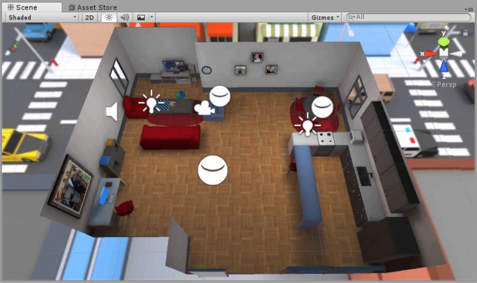

<strong>Tablero de ajedrez:</strong>

Se realizó el tablero de ajedrez tal como se lo mostró en las horas de clase. Utilizando una imagen descargada de internet de un tablero, y luego agregada como textura.

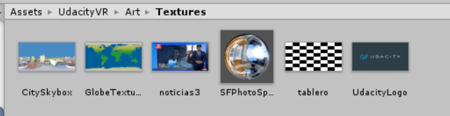

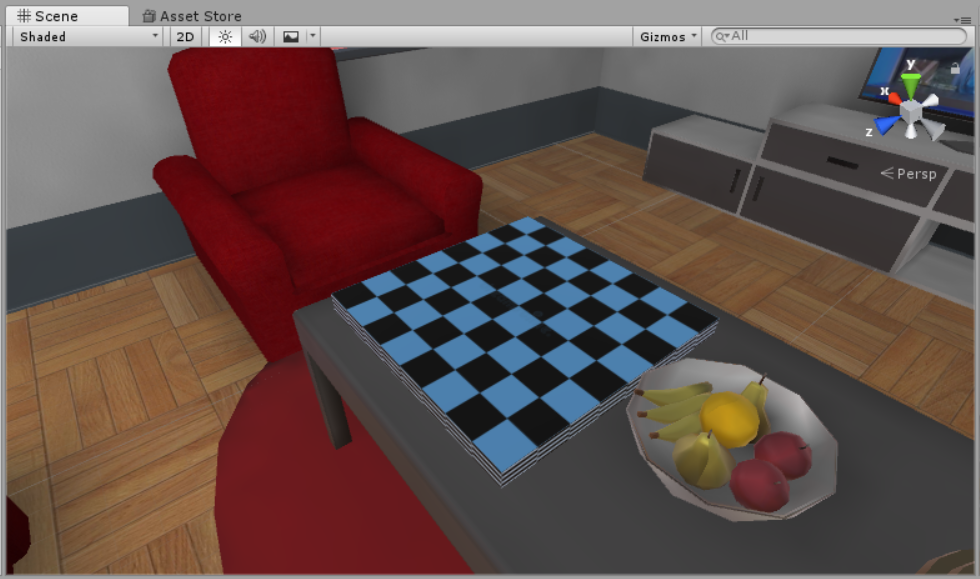

<strong>Retratos:</strong>

Para realizar los retratos, se descargó desde la Asset Store, un modelo propio para realizar los retratos. Posteriormente, crearon diferentes texturas para cada uno de los porta-retratos que se agregó, como se muestra en la siguiente Ilustración, se presenta las imágenes usadas (las 4 primeras).

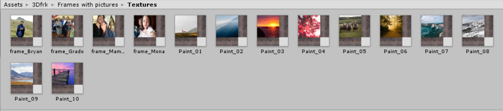

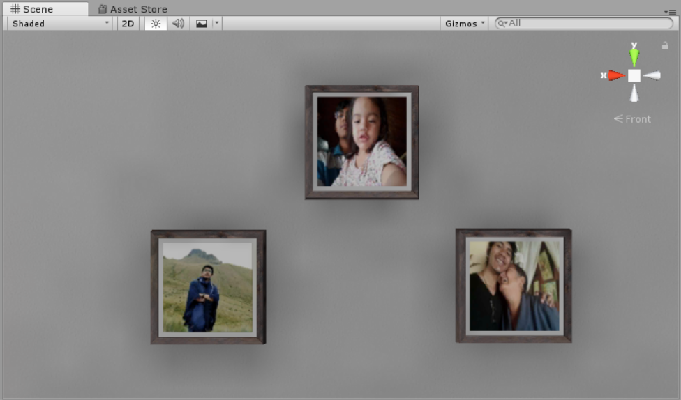

<strong>Globo terráqueo:</strong>

Para realizar el globo terráqueo, se utilizó un objeto 3D “soporte”, incluido en la sección de “Prefabs” del proyecto. Para realizar el globo terráqueo, se utilizó una esfera, y se la acomodó en el soporte.

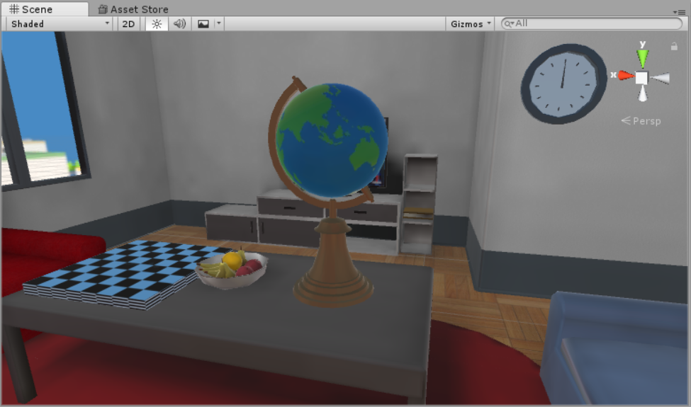

Además, se le agregó una animación que genera una rotación de la esfera. En este caso, la animación dura 2 segundos. Cabe resaltar que las curvas de las animaciones tienen ambas tangentes en lineales, lo que da una mejor visualización de las animaciones.

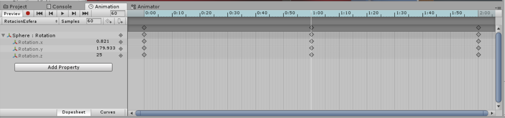

Como se solicitó, también se agregó un trigger que controle la animación. Para ello se tomó como base el ejemplo que se mostró en clase acerca de las manecillas del reloj.

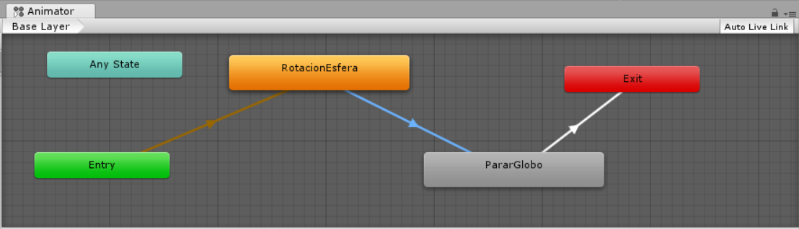

<strong>Reloj:</strong>

El ejemplo del reloj, al igual que otras actividades solicitadas en la presente práctica se la realizó en clase. En este caso, se animó el segundero. Tomando esa misma lógica se crearon dos animaciones más, una para el minutero, y otra para el horero.

Cabe resaltar que solo el segundero contiene el trigger que cambiará el sentido de giro al interactuar con la pantalla.

Además, se debe tener en cuenta que se realizó “una escala” para realizar las animaciones. El segundero da una vuelta completa en 1 segundo. El minutero da la vuelta completa en 60 segundos, y el horero da la vuelta completa en 1440 segundos.

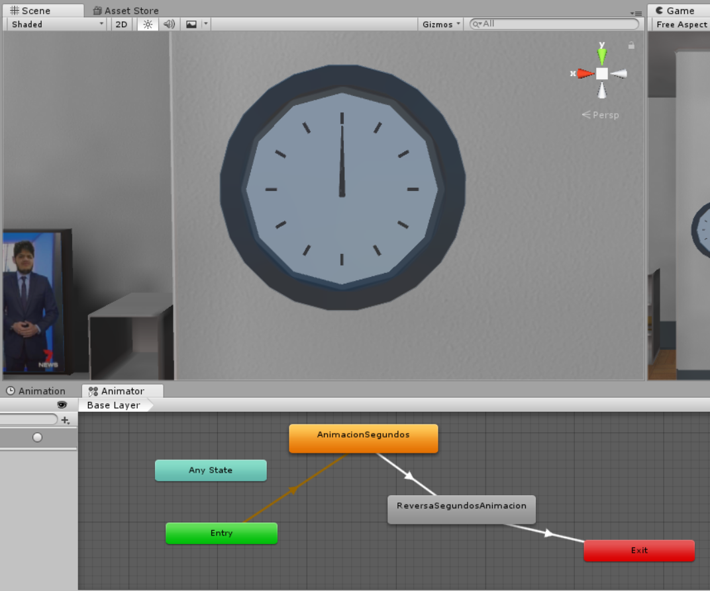

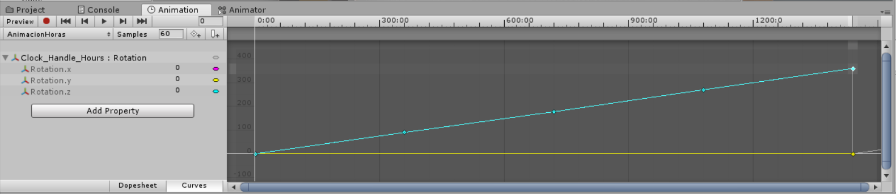

<strong>Otros – Material y Shader para cambiar el color de un objeto:</strong>

En la siguiente Ilustración, se presenta en un cuadrado rojo un material que contiene el shader que cambia el color en base al tiempo de ejecución. Encerrado en un cuadrado verde, se presenta el material sencillo que cambia de color a un objeto.

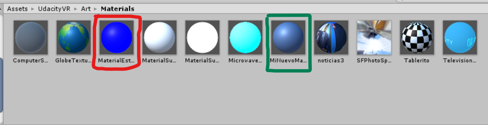

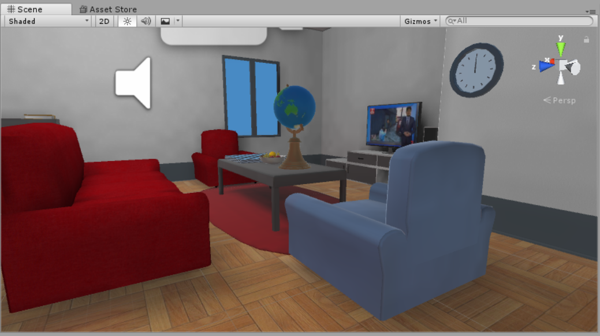

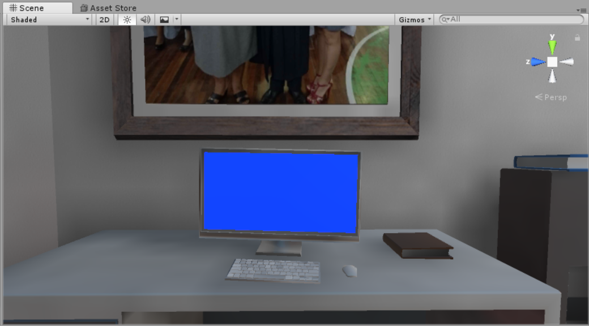

<strong>Otros – Actualizar las configuraciones del Jugador (Player):</strong>

Como se solicitó también se cambiaron ciertas configuraciones de “Player".

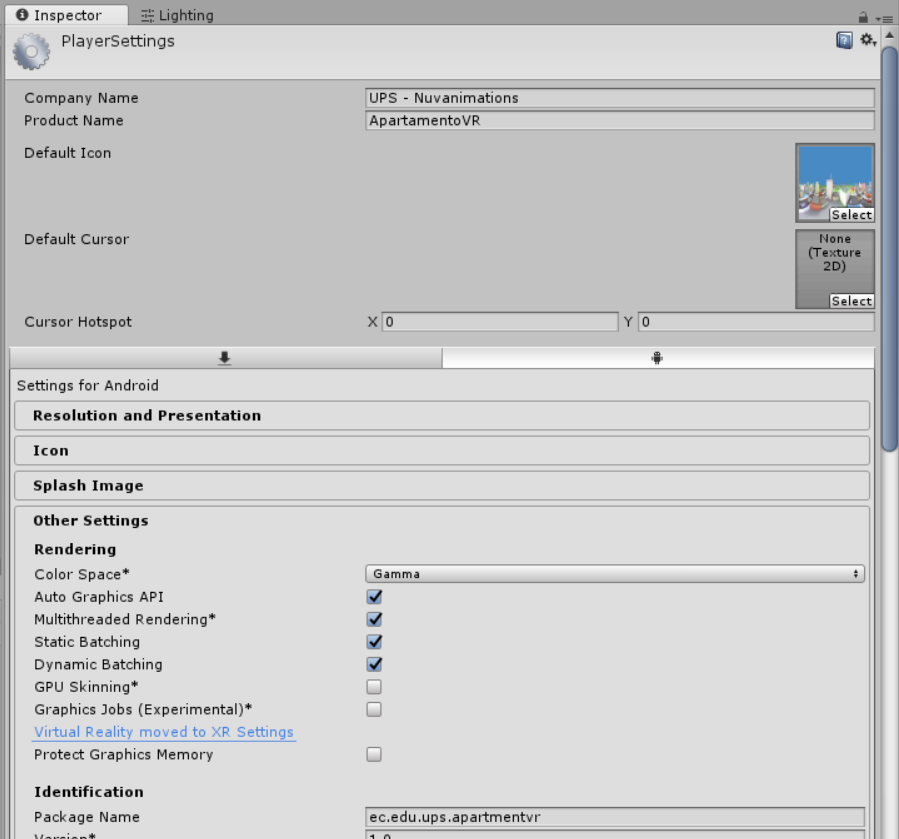

<h3><strong>3.  Presentar la aplicación en ejecución. </strong></h3>

<strong>A. En el PC:</strong>

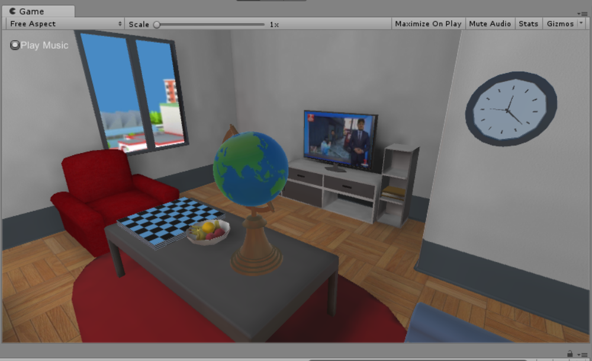

<strong>B. En un dispositivo móvil:</strong>

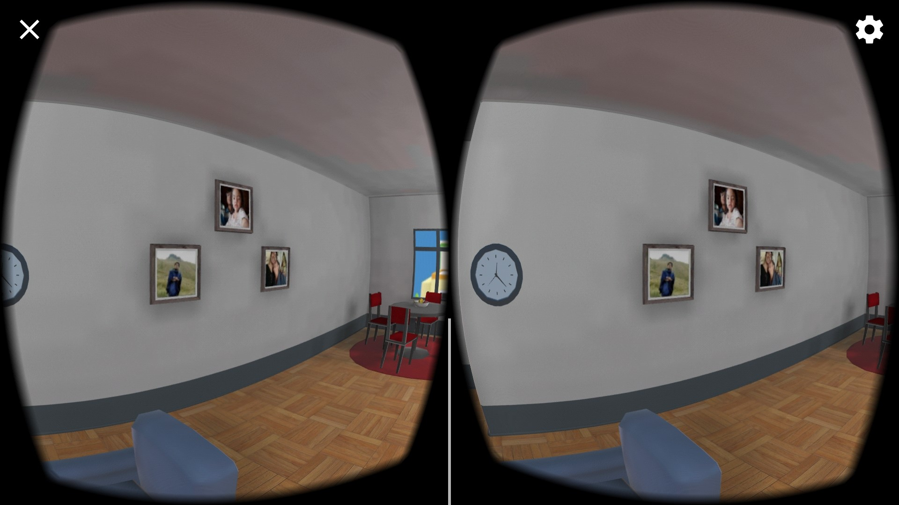

**RESULTADO(S) OBTENIDO(S)**:

- Se logró realizar con éxito las experimentaciones acerca de aplicaciones con realidad virtual y realidad aumentada.
- Se logró comprender acerca de las principales diferencias entre la realidad virtual y realidad aumentada.
- Se logró desarrollar e integrar módulos interactivos virtuales.

**CONCLUSIONES** :

- Unity es una plataforma de diseño 3D, en donde se puede simular y realizar simulaciones, animaciones e integrar diferentes herramientas para la creación de aplicaciones para realidad virtual, pudiendo así también realizar las importaciones para poder desplegarlos en dispositivos móviles.

**RECOMENDACIONES** :

- Haber asistido a las sesiones de clase.
- Revisar el contenido teórico del tema.
- Realizar las preguntas respectivas al docente a cargo.
- Salvar de manera periódica el diseño a fin de evitar pérdidas por alguna falla del software.

**Estudiante:** Sarmiento Douglas Bryan Sarmiento.